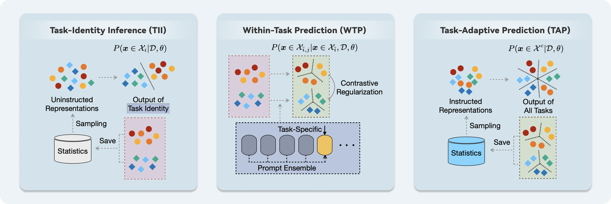

<div align="center">
  
  <div>
  <h1>Hierarchical Decomposition of Prompt-Based Continual Learning: Rethinking Obscured Sub-optimality</h1>
  </div>

  <div>
      Liyuan Wang&emsp; Jingyi Xie&emsp; Xingxing Zhang&emsp; Mingyi Huang&emsp; Hang Su&emsp; Jun Zhu
  </div>
  <br/>

</div>

The official implementation of HiDe-Prompt (NeurIPS 2023, Spotlight) and its generalized version.



In this work, we reveal that the current prompt-based continual learning strategies fall short of their full potential under the more realistic self-supervised pre-training, which is essential for handling vast quantities of unlabeled data in practice. 
This is largely due to the difficulty of task-specific knowledge being incorporated into instructed representations via prompt parameters and predicted by uninstructed representations at test time. To overcome the exposed sub-optimality, we conduct a theoretical analysis of the continual learning objective in the context of pre-training, and decompose it into hierarchical components: within-task prediction, task-identity inference, and task-adaptive prediction.
Following these empirical and theoretical insights, we propose **Hierarchical Decomposition (HiDe-)Prompt**, an innovative approach that explicitly optimizes the hierarchical components with an ensemble of task-specific prompts and statistics of both uninstructed and instructed representations, further with the coordination of a contrastive regularization strategy. 
Our extensive experiments demonstrate the superior performance of HiDe-Prompt and its robustness to pre-training paradigms in continual learning.


## Requirements
- Python 3.6+  
```pip install -r requirements.txt```

## Experimental Setup
Our code has been tested on four datasets: CIFAR-100, ImageNet-R, 5-Datasets, and CUB-200:
### Dataset
- [CIFAR-100](https://www.cs.toronto.edu/~kriz/cifar-100-python.tar.gz)
- [Imagenet-R](https://people.eecs.berkeley.edu/~hendrycks/imagenet-r.tar)
- 5-Datasets (including SVHN, MNIST, CIFAR10, NotMNIST, FashionMNIST)
- [CUB-200](https://data.caltech.edu/records/65de6-vp158/files/CUB_200_2011.tgz)

### Supervised and Self-supervised Checkpoints
We incorporated the following supervised and self-supervised checkpoints as backbones:
- [Sup-21K VIT](https://storage.googleapis.com/vit_models/imagenet21k/ViT-B_16.npz)
- [iBOT-21K](https://lf3-nlp-opensource.bytetos.com/obj/nlp-opensource/archive/2022/ibot/vitb_16_pt22k/checkpoint.pth)
- [iBOT](https://lf3-nlp-opensource.bytetos.com/obj/nlp-opensource/archive/2022/ibot/vitb_16/checkpoint_teacher.pth)
- [MoCo v3](https://dl.fbaipublicfiles.com/moco-v3/vit-b-300ep/vit-b-300ep.pth.tar)
- [DINO](https://dl.fbaipublicfiles.com/dino/dino_vitbase16_pretrain/dino_vitbase16_pretrain.pth)  
  
Please download the self-supervised checkpoints and put them in the /checkpoints/{checkpoint_name} directory.

## Usage
To reproduce the results mentioned in our paper, execute the training script in /training_script/{train_{dataset}_{backbone}.sh}. e.g. 
- **HiDe-Prompt**: if you want to train the continual learning model on CIFAR-100 with the ViT-B-16 checkpoint used as the backbone, you can execute the following command:
```
python -m torch.distributed.launch \
        --nproc_per_node=8 \
        --use_env main.py \
        cifar100_hideprompt_5e \
        --original_model vit_base_patch16_224 \
        --model vit_base_patch16_224 \
        --batch-size 24 \
        --data-path ./datasets/ \
        --output_dir ./output/cifar100_sup21k_multi_centroid_mlp_2_seed$seed \
        --epochs 20 \
        --sched constant \
        --seed $seed \
        --train_inference_task_only \
        --lr 0.0005 

python -m torch.distributed.launch \
	--nproc_per_node=8 \
	--master_port='29501' \
	--use_env main.py \
	cifar100_hideprompt_5e \
	--model vit_base_patch16_224 \
	--original_model vit_base_patch16_224 \
	--batch-size 24 \
	--epochs 50 \
	--data-path ./datasets \
	--ca_lr 0.005 \
	--crct_epochs 30 \
	--seed $seed \
	--prompt_momentum 0.01 \
	--reg 0.1 \
	--length 5 \
	--sched step \
	--larger_prompt_lr \
	--trained_original_model ./output/cifar100_sup21k_multi_centroid_mlp_2_seed$seed \
	--output_dir ./output/cifar100_vit_pe_seed$seed

```
- **Dual-Prompt/S-Prompt/L2P**: if you want to train the continual learning model on CIFAR-100 with the ViT-B-16 checkpoint used as the backbone, you can execute the following command:
```
python -m torch.distributed.launch \
        --nproc_per_node=8 \
        --master_port='29503' \
        --use_env main.py \
        cifar100_l2p \
        --model vit_base_patch16_224 \
        --original_model vit_base_patch16_224 \
        --batch-size 24 \
        --data-path ./datasets \
        --output_dir ./output \
        --seed 42 \
        --epochs 5 
```
```
python -m torch.distributed.launch \
        --nproc_per_node=8 \
        --master_port='29503' \
        --use_env main.py \
        cifar100_sprompt_5e \
        --model vit_base_patch16_224 \
        --original_model vit_base_patch16_224 \
        --batch-size 24 \
        --data-path ./datasets \
        --output_dir ./output \
        --seed 42 \
        --epochs 40 
```
```
python -m torch.distributed.launch \
        --nproc_per_node=8 \
        --master_port='29503' \
        --use_env main.py \
        cifar100_dualprompt \
        --model vit_base_patch16_224 \
        --original_model vit_base_patch16_224 \
        --batch-size 24 \
        --data-path ./datasets \
        --output_dir ./output \
        --seed 42 \
        --epochs 40 
```
- **HiDe-LoRA**: if you want to train the continual learning model on CIFAR-100 with the ViT-B-16 checkpoint used as the backbone, you can execute the following command:
```
python -m torch.distributed.launch \
        --nproc_per_node=8 \
        --master_port='29510' \
        --use_env main.py \
        cifar100_continual_lora \
        --model vit_base_patch16_224 \
        --original_model vit_base_patch16_224 \
        --batch-size 24 \
        --data-path /home/xiejingyi/data \
        --output_dir ./output/cifar_vit_continual_lora_seed42 \
        --seed 42 \
        --epochs 20 \
        --lr 0.01 \
        --lora_type continual \
        --num_tasks 10 \
        --lora_rank 8

python -m torch.distributed.launch \
        --nproc_per_node=8 \
        --master_port='29510' \
        --use_env main.py \
        cifar100_hidelora \
        --model vit_base_patch16_224 \
        --original_model vit_base_patch16_224 \
        --batch-size 24 \
        --data-path /home/xiejingyi/data \
        --output_dir ./output/cifar_vit_hidelora_seed42 \
        --seed 42 \
        --epochs 20 \
        --lr 0.01 \
        --lora_type hide \
        --num_tasks 10 \
        --trained_original_model ./output/cifar_vit_continual_lora_seed42 \
        --lora_rank 8
```
- **Few-Shot-LoRA**: if you want to test the few-shot learning ability of up-stream LoRA, you can use the following command:
```
python -m torch.distributed.launch \
        --nproc_per_node=8 \
        --master_port='29500' \
        --use_env fsl.py \
        imr_few_shot_lora \
        --model vit_base_patch16_224 \
        --original_model vit_base_patch16_224 \
        --batch-size 24 \
        --data-path ./datasets \
        --output_dir ./output/ \
        --seed 42 \
        --epochs 50 \
        --lr 0.01 \
        --lora_type hide \
        --num_tasks 8 \
        --fs_backbone vanilla \
        --train_vanilla \
        --vanilla_model_output_dir ./output/imr_vit_vanilla_model \
        --shared_model_output_dir ./output/imr_vit_shared_model \
        --lora_rank 8

python -m torch.distributed.launch \
        --nproc_per_node=8 \
        --master_port='29500' \
        --use_env fsl.py \
        imr_few_shot_lora \
        --model vit_base_patch16_224 \
        --original_model vit_base_patch16_224 \
        --batch-size 24 \
        --data-path ./datasets \
        --output_dir ./output/ \
        --seed 42 \
        --epochs 50 \
        --lr 0.01 \
        --lora_type hide \
        --num_tasks 8 \
        --fs_backbone shared \
        --train_shared \
        --vanilla_model_output_dir ./output/imr_vit_vanilla_model \
        --shared_model_output_dir ./output/imr_vit_shared_model \
        --lora_rank 8

python -m torch.distributed.launch \
        --nproc_per_node=1 \
        --master_port='29500' \
        --use_env fsl.py \
        imr_few_shot_lora \
        --model vit_base_patch16_224 \
        --original_model vit_base_patch16_224 \
        --batch-size 24 \
        --data-path ./datasets \
        --output_dir ./output/ \
        --seed 42 \
        --epochs 50 \
        --lr 0.01 \
        --lora_type hide \
        --num_tasks 8 \
        --num_fs_epochs 50 \
        --num_shots 5 \
        --train_few_shot \
        --fs_backbone shared \
        --num_episodes 50 \
        --vanilla_model_output_dir ./output/imr_vit_vanilla_model \
        --shared_model_output_dir ./output/imr_vit_shared_model \
        --lora_rank 8
```


If you encounter any issues or have any questions, please let us know. 

## Acknowledgement
This repository is developed mainly based on the PyTorch implementation of [Dual-Prompt](https://github.com/JH-LEE-KR/dualprompt-pytorch). Many thanks to its contributors!

## **Citation**

If you find this code helpful to your work, please cite our paper:

```bibtex
@article{wang2023hide,
  title={Hierarchical Decomposition of Prompt-Based Continual Learning: Rethinking Obscured Sub-optimality},
  author={Wang, Liyuan and Xie, Jingyi and Zhang, Xingxing and Huang, Mingyi and Su, Hang and Zhu, Jun},
  journal={Advances in Neural Information Processing Systems},
  year={2023}
}

@article{wang2023towards,
  title={Towards a General Framework for Continual Learning with Pre-training},
  author={Wang, Liyuan and Xie, Jingyi and Zhang, Xingxing and Su, Hang and Zhu, Jun},
  journal={arXiv preprint arXiv:2310.13888},
  year={2023}
}
```

